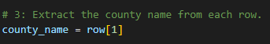
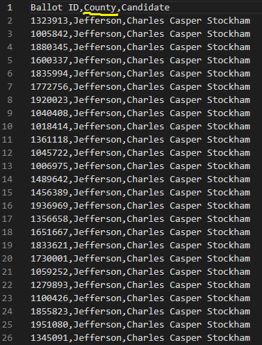
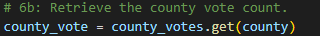
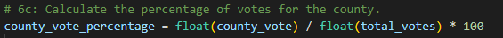

# Election_Analysis

## Project Overview
A Colorado Board of Elections employee has given me the task of reporting the total number of votes casted, the total number of votes for each candidate has received, the percentage of votes for each candidate and the winning candidate based on the popular vote through the power of Python. 

## Summary/ Findings
* Calculate the number of votes cast:
  * Through this project, I have calculated that the amount of votes that has been casted was 369,711.
* Get a complete list of candidates who received votes.
  * The three candidates who received votes were: 
  * Charles Casper Stockham
  * Diana DeGette 
  * Raymon Anthony Doane
* Calculate the total number of votes each candidate won.
  * Charles Casper Stockham received ***23.0%*** of the votes with 85,213 votes.
  * Diana DeGette received ***73.0%*** of the votes with 272,892 votes.
  * Raymon Anthony Doane received ***3.1%*** of the votes with 11,606 votes.
* Determine the winner of the election based on the popular vote.
  *The winner of the election based on the popular vote is Diana DeGette who won ***73.*%*** of the vote with the winning vote count of 272,892

## Resources
* Data Source: election_results.csv
* Software: Python 3.6.1, Visual Studio Code, 1.38.1
  
## Challenge Overview
I was given the task to automate the  of this information through Python and find the voter turnout for each county, the percentage of votes from each county out of the total count, and the county with the highest turnout! Unfortunately my code is only showing one county but from what I gathered, in  the CSV file, it is divided by columns. The Ballot ID would be 0 while the County would be considered 1 which is why I placed that number in the county list.
### My input

### Reasoning

### Start of for loop
I then used a for loop to go through my data and retrieve the county vote.

### Float
Next I calculated the percentage of county votes using the float attribute.

I then saved the results over to the txt_file.

## Challenge Summary
This challenge required a lot of going back and fixing my code. Like I stated before, unfortunately my code does not bring in the different counties however I believe I was moving in the right direction.

Because of this challenge, I have learned how to read and extract data from a CSV file, how to declare variables, writing the data to an output file and much more.
